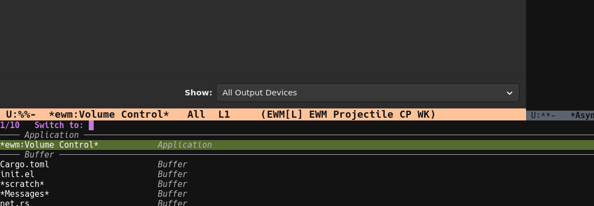

# ewm-consult

Consult/completion integration for [EWM](https://github.com/ezemtsov/ewm).



Emacs distinguishes between regular buffers and file-visiting buffers. Consul neatly separates these two when running  ("C-x b" . consult-buffer). Currently ewm-managed applications are grouped in with regular non-file-visiting buffers and this somewhat irks me as not only aren't these what I'd expect from a buffer, it's also a bit disorganized.

This package configures Consul to treat ewm-managed applications as separate buffer sources -- currently named "Applications". Please help me find a better name for them; one that goes after "Buffers" alphabetically as I do believe the correct order when popping up consult-buffer should be Buffers, "Applications", Files :-).


## Installation and Usage

Place this repo on your `load-path`, then load it after `ewm`.

```elisp
(use-package ewm
  :load-path "~/git/ewm/lisp")

(use-package ewm-consult
  :load-path "~/git/ewm-consult"
  :after ewm)
```

When `ewm-consult` is loaded, it automatically tracks `ewm-mode` using
`ewm-mode-hook` and enables/disables integration as `ewm-mode` toggles.

Behaviour is configured through:
```elisp
(setq ewm-consult-annotate-application-buffers t)
(setq ewm-consult-separate-application-source t)
```

Enjoy finding your applications more easily :-).

## License

GPL-3.0-or-later
